# Programación y Plataformas Web

**Estudiante:** Diana Avila
**Correo:** 📧 [Diana Avila](davilam3p@est.ups.edu.ec)
💻 **GitHub:** [Diana Avila](https://github.com/davilam3/icc-ppw-u4-spring_pagination.git)

## **9. Resultados y Evidencias Requeridas**

La carga masiva se ejecutó exitosamente y se comprobó el correcto funcionamiento de las relaciones N:N, cumpliendo con todos los requisitos planteados.

### **9.1. Datos para revisión**

**Usar un dataset de al menos 1000 productos**:
Crear un script de carga masiva para poblar la base de datos con datos variados:
- al menos 5 usuarios
- alemnos 2 categorias por producto  
- Precios variados ($10 - $5000)
- Nombres con texto buscable

### **9.2. Evidencias de funcionamiento** Caputuras de Postman
1. **Page response**: `GET /api/products?page=0&size=5` mostrando metadatos completos

2. **Slice response**: `GET /api/products/slice?page=0&size=5` sin totalElements
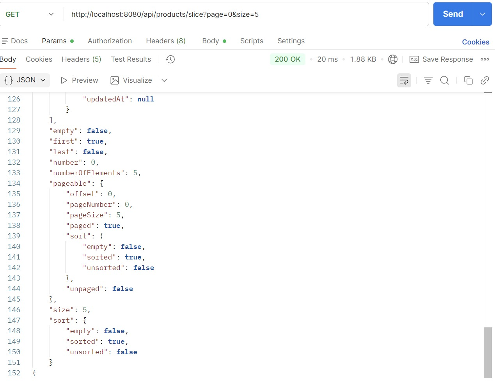

3. **Filtros + paginación**: `GET /api/products/search?name=laptop&page=0&size=3`
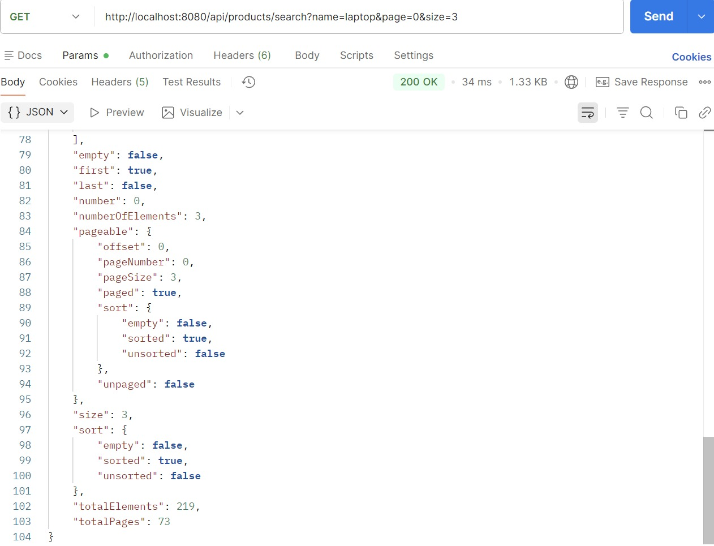

4. **Ordenamiento**: `GET /api/products?sort=price,desc&page=1&size=5`
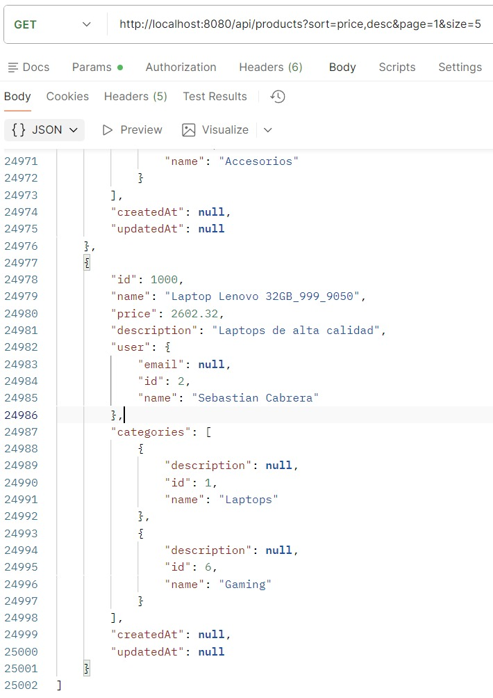

### **9.3. Evidencias de performance**
1. **Comparación**: Tiempos de respuesta Page vs Slice

**Consultas de prueba con volumen**:
 #### PAGE
1. Primera página de productos (page=0, size=10)
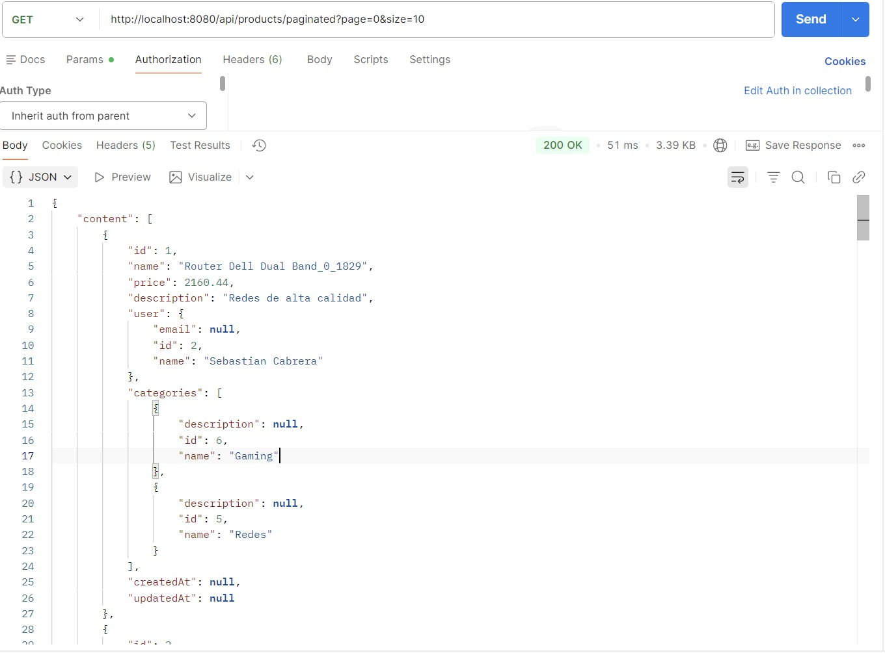
2. Página intermedia (page=5, size=10) 

3. Últimas páginas para verificar performance
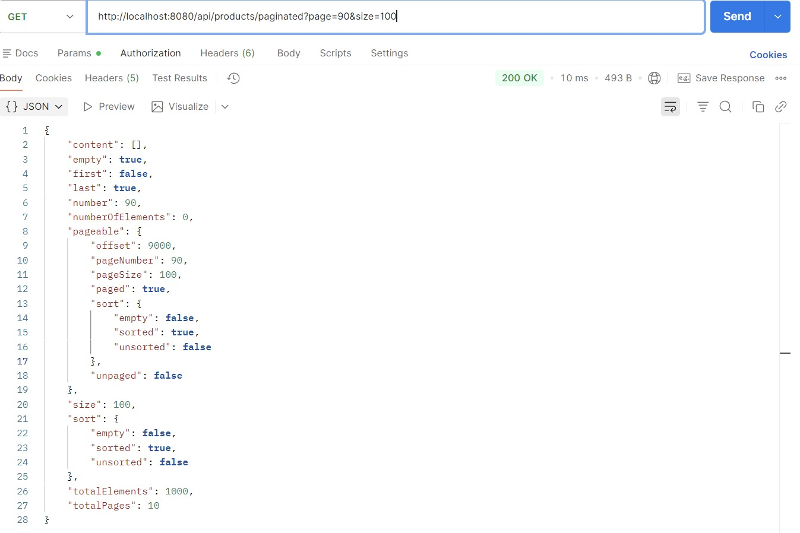
4. Búsquedas con pocos y muchos resultados
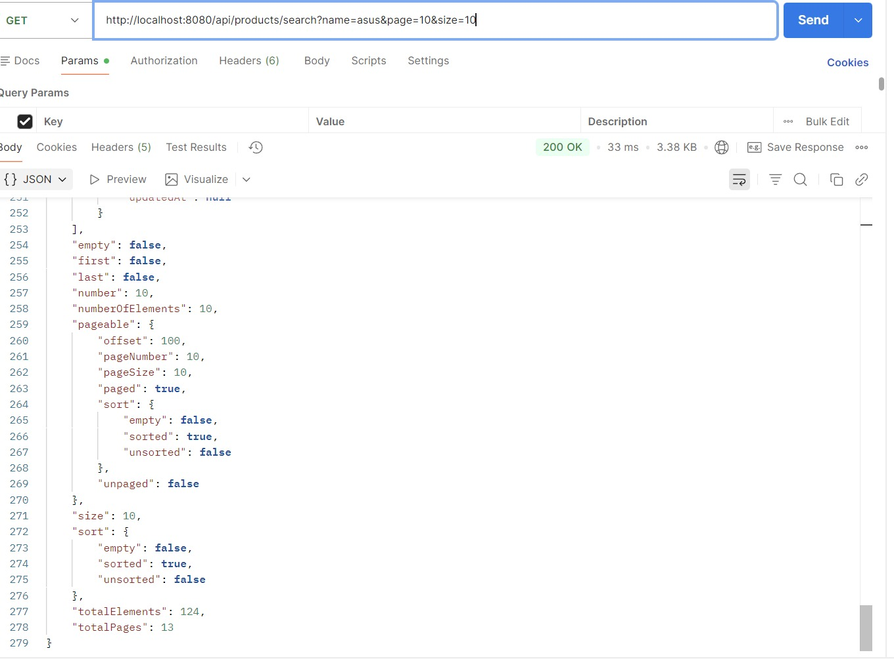
5. Ordenamiento por diferentes campos
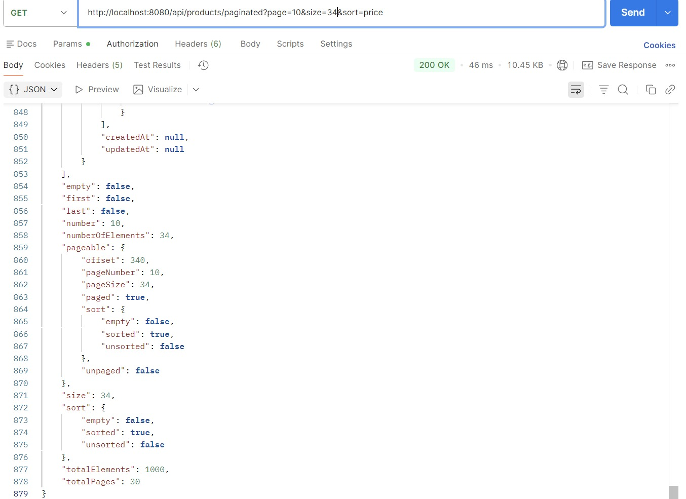
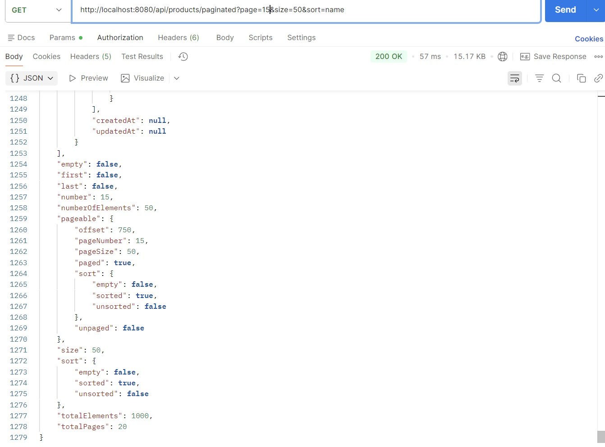

#### SLICE
**Consultas de prueba con volumen**:
1. Primera página de productos (page=0, size=10)

2. Página intermedia (page=5, size=10) 
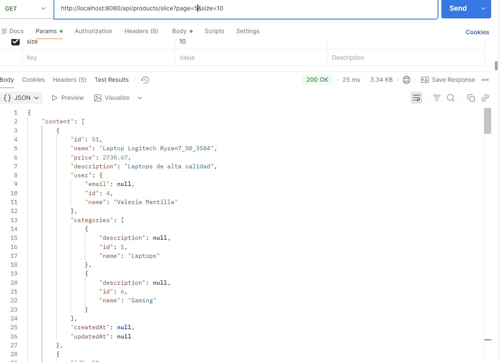
3. Últimas páginas para verificar performance
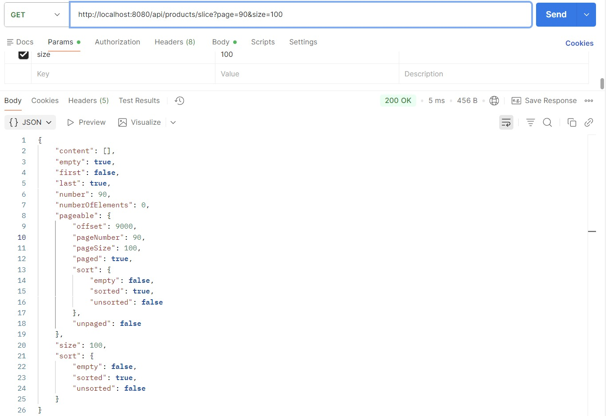
4. Búsquedas con pocos y muchos resultados
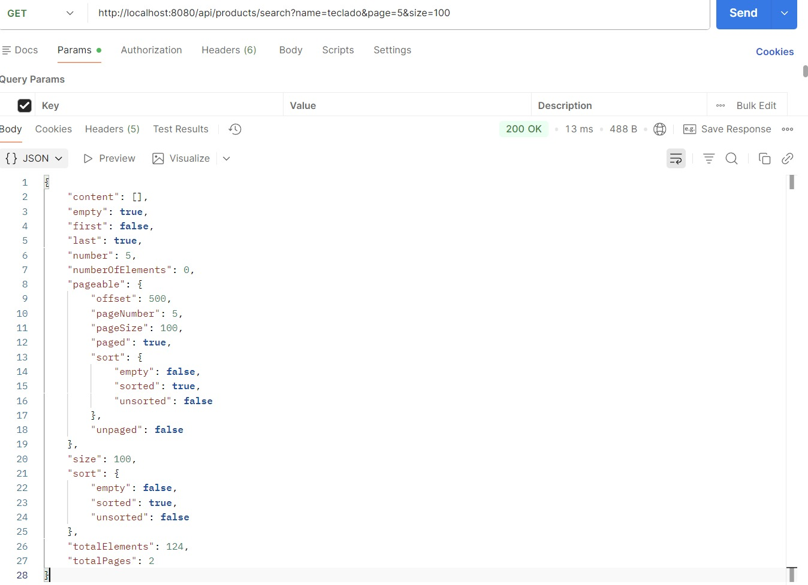
5. Ordenamiento por diferentes campos
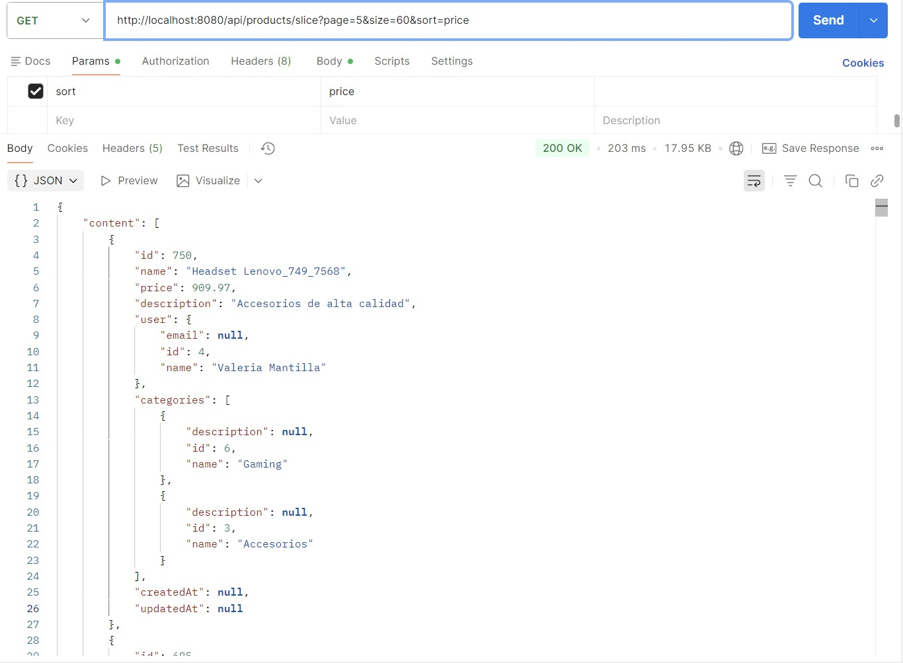
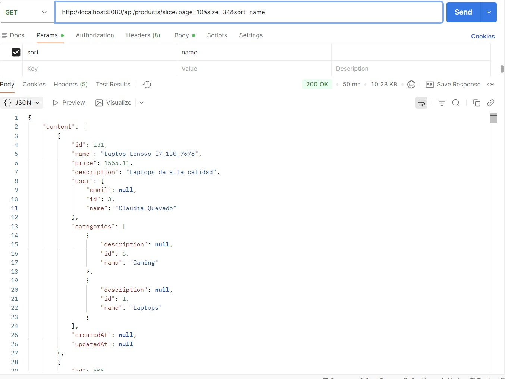
